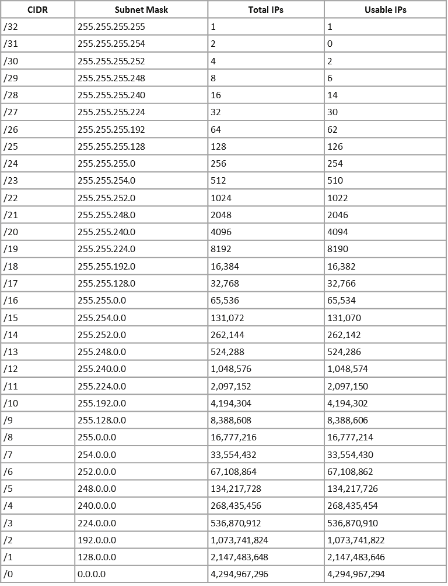

# PART I : Ağ Temellerine Giriş
> Cenk Gökçe - Cyber Security Researcher & Developer
> > [LinkedIn](https://www.linkedin.com/in/cenk-gokce-345b88190)  - [Medium](https://cnkgkce.medium.com/) - [Github](https://github.com/cnkgkce/)

## Network nedir ?
Network kısaca cihazların birbirleriyle bağlantı kurmaları sonucu oluşan yapılardır. LAN/WAN veya Public/Private gibi isimlendirmeler yapılabilmektedir.

 

## Internet nedir ?
Internet ise birden fazla küçük ağların birbirleriyle birlikte oluşturdukları tümleşik yapıdır. Internet dediğimiz yapı devasa bir ağdan ibarettir.

## IP ve MAC Adresleri Nelerdir ?
Cihazlar ağ içerisinde birbirleriyle iletişim kurmak ve bir gateway aracılığıyla internete açılıp uzaktaki bilgisayarlarla, sunucularla iletişim kurabilmek için IP ve MAC adreslerine ihtiyaç duyarlar.

IP adresleri public ve private olmak üzere ikiye ayrılırlar. Public IP adresi internete çıktığımız ve diğer ağlardaki cihazların veya sunucuların bizimle iletişim kurmaları için kullanılmaktadır. Public IP adresi internet ortamındaki kimliğimizdir.

Private IP adresi ise aynı ağ içerisinde bulunan diğer cihazlarla iletişim kurmamıza olanak tanıyan IP adresi türüdür.

### MAC Adresi Nedir ?
Bilgisayar üreticileri ürettikleri her cihazın ana kartına bir mikroçip şeklinde ağ arayüzü (network interface) yerleştirirler. Bu mikroçip sayesinde cihazlar ağ içerisinde fiziksel olarak tanımlanabilir, internete erişim sağlayabilir. Üreticilerin oluşturdukları bu mikroçiplere özgün bir adres atanır. Bu adrese MAC (Media Access Controll) adı verilir. Bu adres spoof edilebilir (değiştirilebilir, taklit edilebilir)

### IP adreslerinin sınıflandırılması

### Private IP adresleri nelerdir ?

*Bilgisayarınızın private ip adresini  öğrenmek için Windows tarafında "ipconfig" komutunu Linux veya macOS için ise "ifconfig" komutlarını kullanabilirsiniz.

### Yerel Ağ Topolojileri ve Ağ Cihazları
 Yaygın olarak kullanılan 3 farklı topoloji bulunmaktadır fakat bu kurs boyunca bu topolojileri detaylı bir şekilde incelemiyoruz. Bu topolojiler bus, star ve ring. 

 #### Switch ve Router Nedir ?

Router'ın temel amacı LAN içerisindeki farklı networkler arasında veri transferine olanak sağlamak iken switch'in temel amacı network içerisinde birnevi modem görevi görerek  bağlı bulunan cihazlar arasında veri iletimini sağlamaktır.

IP Routing işlemleri ile farklı networkler arasında da veri iletimi sağlanabilir ve bu durum güvenlik açısından da başka bir takım sorunlara sebebiyet verebilir.

### Subnet nedir ?
Subnet, içerisinde bulunduğumuz ağı daha küçük ağlara bölme işlemidir.

Subnet güvenlik konusunda da bize oldukça faydalı bir işlemdir. Örneğin 

Yukarıdaki görselde Compec Corp içerisinde 2 farklı subnet ve içlerinde A B ve C bilgisayarları bulunmakta. Yukarıdaki şemaya göre uygun subnet uygulaması yapıldığında A ve B cihazlarının C cihazıyla iletişim kurabilmeleri için bir yönlendirice ihtiyaçları vardır. Bu işleme IP Routing denmektedir.

### Subnet Mask Nedir  ?
Subnet Mask, network içerisinde subnet işlemi yapabilmemize imkan sağlayan yapıdır ve sistemin IP adresinin ağ bölümünü maskeler/gizler. Defaultta en yaygın  255.255.255.0 kullanımı  görülür çünkü C class IP adresleri genel kullanımımızdadır.

CIDR veya BGP Prefix, subnet maskleri  ifade etmenin bir diğer yoludur. Pratik olması  açısından sadece CIDR değeriyle de ifade edilebilir.

Örneğin subnet mask 255.255.255.0 ise sadece sondaki değer kadar yani 256 tane IP adresi bu subnete bağlanabilir demektir. Eğer subnet  mask  255.255.0.0. ise son iki basamak kadar değer değişebilir bu da 65,536 karşılık gelir. Özellikle /24 ve /16 prefixleri gündelik  testlerde karşılaşacağımız subnetlerdir.

### IP Adresi  nasıl hesaplanır ?

## Önemli İletişim Protokolleri
Cihazlar gerek lokalde gerekse uzaktaki bir cihaz ile iletişime geçmek için çeşitli protokolleri ve alt yapıları kullanırlar. Bizim bu kurs  boyunca öğreneceğimiz en önemli iki iletişim protokolleri "TCP/IP" ve "UDP" protokolleridir.(TCP -> Transmission Control Protocol | UDP -> User datagram protocol)

### TCP/IP Protokolü
TCP/IP protokolü cihazlar arasında gerçekleştirilen "connection based" bir iletişim protokolüdür. UDP'ye göre oldukça güvenli fakat daha yavaş çalışan bir protokoldür. İletişiminde "Three Way Handshake" yöntemini kullanır.

Yukarıdaki görsel TCP/IP protokolünün temelindeki three-way handshake yöntemini göstermektedir.

### UDP
Genelde medya işlemlerinde (video,ses, görüntü vb) kullanılan, TCP/IP ye göre oldukça hızlı ama daha az güvenli bir protokoldür çünkü UDP connectionless çalışır ve gönderilen paketin karşı tarafa ulaşıp ulaşmadığının kontrolünü sağlamaz. Bu durum da veri kaybına sebebiyet verebilmektedir.

### TCP/IP vs UDP
.png)

### ARP (Address Resolution Protocol)
Ağ içerisindeki cihazların kimliklerinin tespiti için IP adresi ve MAC adreslerine ihtiyaç duyduğundan bahsetmiştik. Aynı ağ içerisindeki cihazların IP adresleri ve MAC adreslerini çözümleme(eşitleme) işlemini gerçekleştiren protokol **ARP**'tır. Kısaca hangi IP adresine sahip cihaz hangi MAC adresine sahiptir sorusunun cevabını verir. Broadcasting kullanır.

### DHCP (Dynamic Host Configuration Protocol)
Ağa bağlanan cihazların dinamik bir şekilde IP adresi almalarını sağlayan protokoldür. ARP gibi broadcast kullanır.

>Broadcast(yayın) kısaca ağ içerisinde yapılan bir isteğin, ağ içerisindeki tüm cihazları haberdar edip ilgili isteği her cihaza gönderme veya haberdar etme işlemidir. 0.0.0.0 'a yapılan tüm istekler broadcastingdir.

(eyyy routerrrr!!)

### ICMP (Internet Connection Message Protocol)
ICMP, TCP/IP veya UDP den çok daha basit bir şekilde ilgili paketlerin hedefe gidip gitmediğinin kontrolünü sağlama ve performans değerlendirme amacıyla kullanılan protokoldür. Windows, Linux veya macOS cihazlarda default olarak gelen "ping" isimli araç sayesinde hedef cihaza ICMP Echo paketleri göndererek ağ içerisinde ayakta olup olmadığını tespit edebiliriz.

>**DDoS saldırıları yukarıdaki protokoller aracılığıyla gerçekleşmektedir. SYN Flood, UDP Flood saldırıları özellikle TCP/IP üzerinden gerçekleştirilir.**

Şimdi ise yukarıda öğrendiğimiz protokolleri Wireshark aracını kullanarak inceleyelim.

## OSI (Open Systems Interconnection) modeli nedir ?
Bilgisayar ağları teorisini modelleyen ve günümüzde TCP/IP modeline alternatif olarak en sık tercih edilen modeldir. ISO (International Organization  for Standardization) tarafından geliştirilmiştir.

Toplamda 7 katmanı bulunmaktadır.

# PART II : Ağ içi Saldırılara Giriş
Bu kısımdaki saldırıların birkısmını gerçekleştirmek için **Monitör modu destekleyen bir wifi kartına ihtiyacımız olacaktır** fakat satın almanıza gerek yok ders videolarını izleyerek ve not alarak da ilerleyebilirsiniz.

Şimdi ise adım adım ağa nasıl sızılır ve sızma işlemini gerçekleştirdikten sonra (bazı durumlarda ağa sızmanıza gerek kalmadan ağın içerisinde de olabilirsiniz, cafe,okul vs..)
ağ içerisinde hangi saldırıları kullanarak ilerleyebiliriz buna bakalım.

## Man in The Middle (Ortadaki Adam) Saldırısı
Belki de en eski fakat halen aktif olarak kullanılan genel bir saldırı konseptidir. Ortadaki adam saldırısı kısaca kurban ile sunucu veya birbaşka kurban arasına dahil olarak 3.taraf olmak ve bu sayede iletişimi dinlemek(sniffing,koklamak), değiştirmek ve hatta düşürmek için kullanılır. Ağ içi saldırılarının çok büyük bir kısmı MITM konsepti içerisine dahil edilebilir.

MITM ile yapılabilecek bazı saldırılar şunlardır :

1) DNS Spoofing
2) Wifi Eavesdropping
3) ARP Spoofing
4) SSL Hijacking
5) Network Sniffing

## Ağa Sızalım
Sızma testlerinde de yeri geldiğinde kullanılan parola kırma işlemini gerçekleştirmeye çalışalım fakat parola kırma işlemlerinden ve uygulamasından önce özellikle wifi, switch veya evlerde kullanılan modemlerin authentication işlemlerini nasıl yürüttüklerinden bahsedelim.

Wifi cihazları (AP,Modem,firewall,switch,router...) kendilerine bağlanmak isteyen cihazlardan bir parola isterler. İstedikleri bu parolaya karşılık gelen key değeri ile sahip oldukları key değerlerini karşılaştırarak parolanın doğru olup olmadığını karar verir ve cihazın bağlantı sağlamasına izin verir veya vermez.
Bu cihazlar bu işlemi  "four way handshake" dediğimiz bir yöntem ile yaparlar.

Bu yöntemde client ile modem arasında 4 yönlü bir iletişim gerçekleşir ve birbirlerine çeşitli key'ler iletirler.

### **Saldırı Vektörü : Client ile Modem arasına gir, key'i çal ve offline ortamda kırmaya çalış !**

MITM saldırı konseptini Wifi parolalarını kırma işlemleri için de kullanabilmekteyiz. Yukarıda Wifi ile cihazlar arasında 4 yönlü bir handshake işleminin gerçekleştiğinden ve bu işlem boyunca tarafların birbirlerine çeşitli key'leri ilettiklerinden bahsetmiştik. MITM saldırı konseptini buraya entegre ederek ağa bağlanmak isteyen bir cihazı ağa bağlanırken key'ini çalıp (handshake yakalayarak) bu key'i kırabiliriz. Taraflar key'leri birbirlerine WPA veya WPA2 standartları gereği encrypted halde verdikleri için kolay veya yaygın parola kullanımı sebebiyle parolalar kırılabilmektedir.

#### Deauthentication Saldırısı
Bu saldırının başarılı olabilmesi için cihazların ağa tam olarak bağlanma aşamasında ilgili ağı dinlememiz ve transfer edilen keyi çalmamız gerekiyor. Peki cihazlar ağa zaten önceden bağlılar ise bu durumda ne yapacağız ?

İşte tam bu sırada ağa bağlı cihazları ağdan kısa süreliğine düşürüp tekrar ağa otomatik olarak bağlanmasını sağlamamız gerekmekte. Ağ içerisinde ne kadar çok trafik geçiyorsa handshake yakalama ihtimalimiz de bir o kadar yüksek olacaktır.

Ağa sızmak için takip edeceğimiz adımlar : 

1) Wifi kartımızı cihazımıza uygun şekilde takmak 
2) Wifi kartımızı monitör moda almak
3) airodump-ng aracı sayesinde civarımızdaki ağları keşfetmek
4) Hedef ağa özel olarak airodump-ng aracını tekrar çalıştırmak ve ağ içerisindeki cihazları görüntülemek
5) Ağ içindeki cihazlara deauthentication saldırısı düzenleyerek anlık internetten kopartmak ve geriye bağlanma sırasında MITM sayesinde aradaki keyi çalmak
6) Çaldğımız key'i offline ortamda kırmaya çalışmak ve wifi'in gerçek parolasını elde etmek.

**Bu adımlar sırasıyla derste gösterilmiştir. Ders kaydını izleyebilirsiniz**

## Ağa sızdıktan sonra neler yapılabilir ?

### Ağ içerisindeki cihazları keşfet !
Herhangi bir ağa sızdıktan sonra veya teste başlarken yapılması gereken belki de ilk iş ağı haritalamaktır. Ağ içerisinde hangi cihazların bulunduğunu bu cihazların IP adreslerini ve üzerlerinde çalıştırdıkları servislerin versiyon bilgilerini öğrenmeliyiz. Ne kadar fazla bilgi toplarsak bizim için o kadar iyidir (recon recon recon !)

Bu işlem için biçilmiş kaftan aracımız belki de siber güvenlik tarihindeki en eski ve de-facto araçlardan **nmap** ile mümkün olmaktadır. Nmap aracını daha detaylı bir şekilde inceleyeceğiz fakat kısaca bahsetmek gerekirse içinde bulunduğunuz veya bulunmadığınız farketmeksizin hedefi tarar ve hedefin IP adresiyle birlikte servislerini ve versiyonlarını da getirir. 

nmap kullanımına ders kayıtlarından ulaşabilirsiniz ve bu [linkten](https://tryhackme.com/room/furthernmap) nmap'i daha detaylı bir şekilde öğrenebilirsiniz.

Nmap kadar gelişmiş olmasa da sadece ağ  içerisindeki cihazların IP adreslerini öğrenmek isterseniz **netdiscover** aracını da kullanabilirsiniz.

Eğer bir sızma testi çalışmasındaysak ağa girip port taramalarıyla ağ içerisindeki cihazları keşfettikten sonra bu cihazların üzerinde zafiyet olup olmadığını çeşitli zafiyet tarama araçları yardımıyla tespit edebiliriz (Nessus,Zap Proxy,nmap NSE,Metasploit Framework...)

### Network Sniffing ile ağ içerisindeki trafiği dinle !

Network sniffing yöntemiyle Wireshark, Bettercap gibi araçların da yardımıyla içerisinde bulunduğunuz ağda hangi cihazlar nerelere istekte bulunuyor, kimler hangi sitelere giriyor görebiliriz. Sniffing de yine oldukça eski ve bilinen bir tekniktir fakat özellikle bu tarz saldırılardan korunmak için VPN, özel ağlar veya SSL sertifikası tanımlı web siteleri geliştirilmeye başlandı. Özellikle  aynı ağ içerisindeki bir cihaz SSL Sertifikasına sahip bir web sitesinde işlemler yapsa dahi saldırganlar ağı dinlemelerine rağmen ellerinde şifreli veriler dışında başka birşey olmayacaktır. Buna ek olarak SSL sertifikalarında kullanılan algoritma birşekilde kırılabilir ve spoof edilirse bu sefer SSL içeren web sitesindeki işlemler de ifşa olmuş olur.

Şimdi ise Wireshark aracına dönelim ve içinde bulunduğumuz ağı dinlemeye başlayalım.

 **Wiresharkta ağ içerisindeki diğer paketleri dinlemek için yapmamız gereken ufak bir ayar mevcuttur. Bu ayar ders kayıtlarında bahsedilmiştir.**

**Bu kısmı ders kayıtlarından izleyebilirsiniz...**

### ARP Spoofing Saldırısı ile MITM Uygula

Şimdi ise kendimize spesifik bir kurban seçme vakti fakat öncelikle ARP Spoofinging ne olduğundan bahsedelim.  

ARP'tan daha önce bahsetmiştik. Ağ içerisinde IP ve MAC adresi çözümlemesi yapan protokoldü kendisi. ARP Spoofing saldırısı ise kısaca modem, router vb ile client arasında ortadaki adam saldırısını gerçekleştirerek yapılır ve saldırgan router'a giderek "ben client'ın kendisiyim" diyerek  kendini tanıtırken  aynı zamanda client'a giderek "ben router'ım bu yüzden paketlerini bana gönder" demektedir. Kurban kişisine kendisini  router olarak; router'a ise kendini kurban kişi olarak tanıtan saldırgan bu sayede  router  ile kurban  arasındaki  tüm trafiği kendi üzerinden geçirir.

Şimdi ise network taraması ile ağ içerisinde tespit ettiğimiz kurbanımıza yönelik bir arp spoof saldırısı düzenleyerek kurbanımızın ağ içerisindekini hareketlerini **bettercap**  aracımızla gözlemleyelim.

Network konusu oldukça kapsamlı ve derin bir konu, bu kurs boyunca temellerini anlatmaya çalıştım fakat kurs sonrası özellikle size ilettiğim linklerdeki alıştırmaları yapmanız oldukça kritik ! Alıştırmaları 1 hafta içerisinde yapmanız tavsiye edilir (: