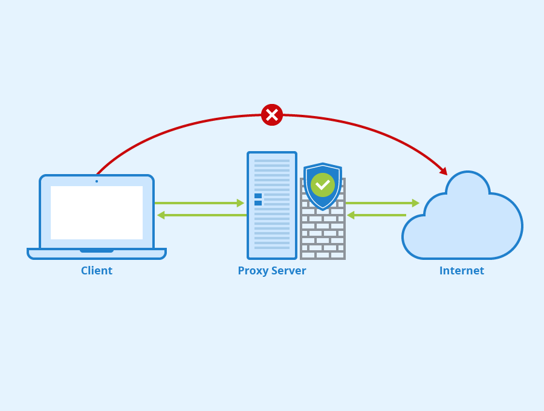
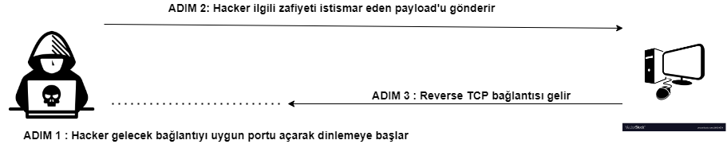
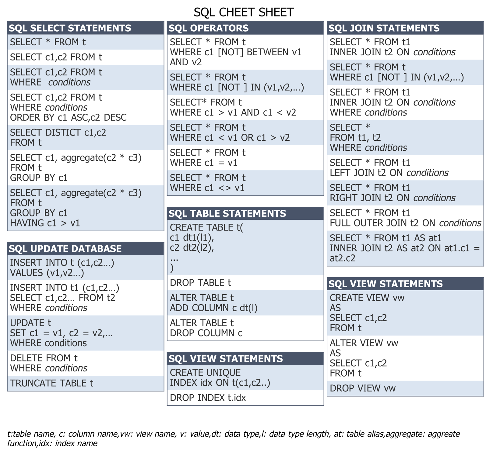
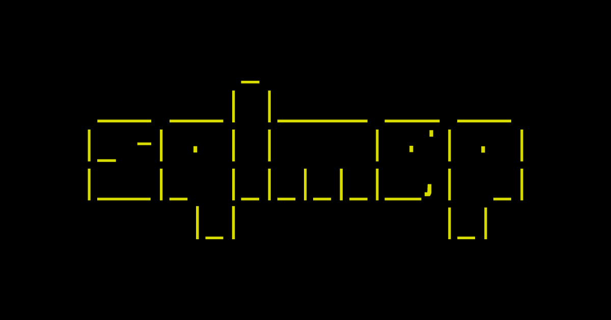
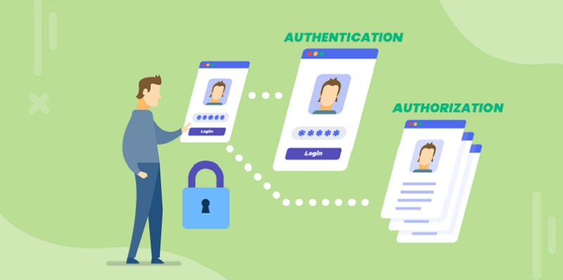
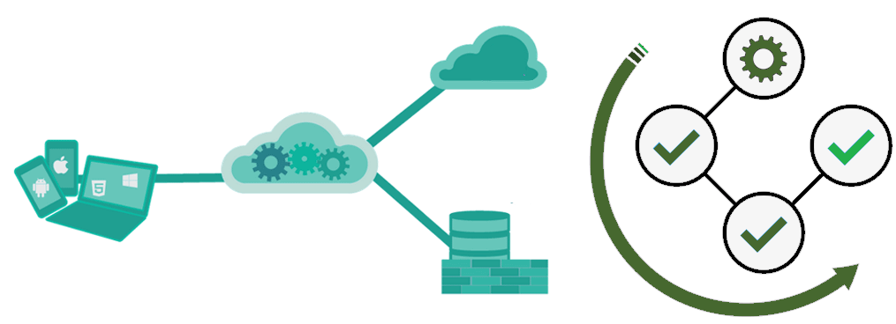
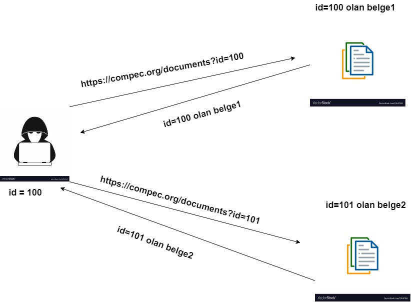

#  WEB UYGULAMA GÜVENLİĞİ GİRİŞ 
> Cenk Gökçe - Cyber Security Researcher & Developer
> > [LinkedIn](https://www.linkedin.com/in/cenk-gokce-345b88190)  - [Medium](https://cnkgkce.medium.com/) - [Github](https://github.com/cnkgkce/)

# Modern Web Uygulamaları Nasıl Çalışır ?

Modern web uygulamalarının nasıl çalıştığına dair detaylı dersimizi kayıtlardan izlemenizi tavsiye ederim.

# Web Uygulamalarını Test Ederken Kullanacağımız Araçlar

Web uygulama testlerini gerçekleştirirken kullanabileceğimiz birçok araç bulunmakta. Bunların bir kısmı open-source iken bir kısmı ise bazı büyük firmalar tarafından lisanslı olarak satılan ürünlerdir.

Tüm araçları tek tek burada işlemeyeceğiz fakat ilerleyen haftalarda CTF çözümlerinde birtakım araçları yerinde görüp öğreneceğiz.

Fakat Web Uygulama testi denildiğinde akla gelen bir araçtan bahsetmemek olmaz çünkü bu araç artık web testlerinin de-facto toolu haline geldi. Aracımızın adı "Burp Suite"

## Burp Suite Aracı

Burp Suite aracı PortSwigger firması tarafından geliştirilen ve web testlerinin artık vazgeçilmez sayılabilecek araçlarından birisidir ve mutlaka hakim olmamız gerekir.

Burp Suite aracı temelde bir Proxy aracı olarak kullanılmaya başlanmıştı. Proxy kavramını detaylı bir şekilde derste anlatacağız fakat özetlemek gerekirse ,

Client ile internet arasında konumlanır ve hem client tarafından internet tarafına hem de internet tarafından client tarafına gelen giden http istek paketlerini yakalamamıza imkan sağlar. Özellikle client tarafından isteğimiz daha browserdan çıkmadan üzerinde değişiklikler yaparak sunucu tarafına gönderebilmemize imkan sağlar.

Günümüzde ise Burp Suite aracı artık sadece bir proxy aracı olarak değil aynı zamanda web uygulamaları üzerinde otomatik olarak zafiyet taramaları yaparak otomatik payload'lar üreten çok güçlü bir araç haline geldi.

Burp suite aracının ilgili bölümleri derste detaylıca işlenmiştir.

# OWASP TOP 10 Zafiyetleri
Bu kurs boyunca OWASP TOP 10 üzerinden Web Uygulama Güvenliğine giriş yapacağız. Bu zafiyetlerin güncel listesine [buradan](https://owasp.org/Top10/) ulaşabilirsin.

## Injection Zafiyetleri

Injection zafiyetleri kapsamında **SQL Injection**, **OS injection**, **XML Injection**, **HTML Injection** gibi zafiyetleri sayabiliriz. Bu kurs boyunca **SQL Injection**, **OS Command Injection** ve **XML Injection** (XXE) inceleyeceğiz.

### OS Command Injection - RCE 
Remote Code Execution (RCE) olarak da bilinen uzaktan komut yürütme ve işletim sistemi düzeyinde komut çalıştırabilme zafiyeti **karşılaşabileceğimiz en kritik saldırı tipidir**

Bu saldırı tipinde saldırgan uzaktan, sunucu üzerinde komut çalıştırabilir. Komut çalıştırabilen saldırgan, sunucuya sızabilir ve ilerleyen süreçte yetkisini yükseltip sunucu üzerinde tam yetki hakkına sahip olabilir veya belkide ağ içerisindeki başka sunuculara geçiş yapabilir. Karşılaşacağımız en kötü senaryodur. Bu sebeple Web Uygulamaları için en kritik zafiyet kabul edilir.

#### Reverse Shell Nedir ?
Modern web uygulamalarında tespit edilen RCE zafiyetleri için Bug Bounty programlarında artık reverse shell ile sunucuya sızma gibi işlemler pek kabul edilmese de sızma testi çalışmalarımızda reverse shell yöntemi ile sunucuya sıklıkla sızmaya çalışırız. Pentesterlar veya hackerlar arasında "shell almak veya shell basmak" gibi tabirlerle de anılabilir.

### SQL Injection
SQL Injection saldırısından önce SQL'in ne olduğundan biraz bahsedelim.

#### SQL Nedir ?
Structured Query Language (SQL) veritabanı üzerinde işlemler yapmamıza imkan sağlayan yapısal bir dildir. Kendi içerisinde çeşitli yazım kuralları mevcuttur. Bu kurs boyunca SQL'i derinlemesine incelemeyeceğiz fakat [buradaki linkten](https://www.w3schools.com/sql/) SQL'in temellerine hakim olmanızı tavsiye ederim.

SQL için güzel bir cheet-sheet,

Siber güvenliğin belki de en eski ve en tanınmış zafiyetlerindendir. Modern web uygulamalarında artık pek sık rastlanılmasa da özellikle veritabanına sorgu atılan her casede dikkatle incelenmesi gereken temel zafiyetlerden birisidir.

SQL Injection sayesinde veritabanı üzerinde istediğimiz bilgileri getirebilir, değişiklik yapabilir, authentication sistemlerini atlatabiliriz.

In-band SQLi(Error-based, Union-based), Blind SQLi(Boolean-based,time-based), Out-of-band SQLi gibi türleri bulunur.

#### SQLMAP Aracı

Penetrasyon testleri sırasında SQL Injection olduğunu düşündüğümüz yerlerde oldukça güçlü bir araç olan SQLMAP aracını kullanabiliriz. SQLMAP aracı diğer birçok otomasyon aracı gibi elbette yanlış sonuçlar üretebilir veya zafiyet bulunsa dahi bazı durumlarda bu zafiyeti tespit edemeyebilir. Bu noktada manuel birtakım testleri yapmak da oldukça kritiktir.

Bunlara ek olarak penetrasyon testleri sırasında çok sorun olmasa da bu tarz araçların kullanımı savunma tarafında oldukça fazla ses üretecektir.

SQLMAP aracı özellikle time-based, error-based, boolean-based türlerinde olmazsa olmaz sayılabilecek araçlardan birisidir ve komunite tarafından düzenli olarak geliştirilmektedir.

### XXE (XML External Entity) Injection
Bu zafiyet 4.hafta detaylıca işlenecektir

## Broken Access Control Zafiyeti

OWASP TOP TEN 2021 de **en fazla** tespit edilen ve raporlanan zafiyet türüdür. 

Uygulamanın kapsamı ve fonksiyonalitesi genişledikçe bu zafiyetle karşılaşma ihtimalimiz de bir o kadar artmaktadır. 

Kimlik ve erişim kontrolü (Identity and Access Management - IAM) son dönemlerde siber güvenlikte üzerinde yoğun çalışmalar yapılan bir alandır.

Bu zafiyet türünde saldırganlar authentication(kimlik doğrulama)  ve authorization(yetkilendirme) gibi kritik işlemleri bypass edebilir ve bunlara ek olarak yetkisi olmayan işlemlerde bulunabilir. Bunlara örnek olarak başka kullanıcıların hassas verilerine ulaşabilme, kendisini yetkili bir kullanıcı gibi gösterebilme veya yetkili bir kullanıcı gibi işlem yapabilme 
sayılabilir.

Bu zafiyetlerin temelinde "Business Logic" adındaki zafiyet konsepti bulunmaktadır. Dolayısıyla bu zafiyetleri istismar ederken herhangi bir saldırı payload'u veya çeşitli kod  veya komutlar geliştirmemize gerek kalmaz. Uygulamanın ana akışını takip ederek gelen ve giden istekler üzerinde çeşitli değişiklikler yaparak bu zafiyet istismar edilebilir.

### IDOR (Insecure Direct Object Referance) Zafiyeti

IDOR'u kısaca özetlemek gerekirse bir tür **erişim güvenlik kontrolü** üzerinde meydana gelen zafiyettir diyebiliriz. IDOR zafiyeti ile saldırganlar yetkileri olmadığı halde başka kullanıcıların adına çeşitli işlemler yapabilmektedirler.

## Sensitive Data Exposure Zafiyeti

Web uygulamaları günden güne geliştikçe saldırganların atak yüzeyleri de bir o kadar genişlemektedir. 

Bu durum bir web uygulamasına bir çok yönden saldırılabilmesi anlamına gelmektedir. Yine modern dünya web uygulamalarında sıklıkla görülen bir diğer zafiyet ise "hassas veri ifşası" zafiyetidir. 

Bu zafiyette saldırganlar çeşitli "fuzzing" işlemleri ve yoğun araştırmalar sonucunda web uygulaması için hassas sayılabilecek ve korunması gereken birtakım bilgilere erişebilirler.

Bu bilgiler uygulama hakkında, sunucu hakkında veya kullanıcılar hakkında olabilmektedir.

### Fuzzing Nedir ?

Fuzzing hem penetrasyon testlerinde pentesterların hem de saldırganların hedefleri hakkında daha detaylı bilgilere erişebilmek için sıklıkla kullandığı bir araştırma yöntemidir.

Directory fuzzing, DNS Fuzzing, sub-domain fuzzing, virtual hosts fuzzing gibi çeşitli türleri bulunmaktadır. Biz bu kurs boyunca önce directory fuzzing'i, ilerleyen haftalarda ise sub-domain fuzzingi inceleyip uygulayacağız.

#### Directory Fuzzing Nedir ?

Directory fuzzing, bir web uygulaması üzerinde barınan dosyaları keşfetmek için yürütülen çalışmalardır. Bu çalışmalar neticesinde hassas dosyalara ulaşılabilir, önemli endpointler tespit edilebir.

Bir web penetrasyon testi için olmazsa olmaz çalışmalardan birisidir fakat modern web uygulamalarında WAF(Web Application Firewall) sıklıkla kullanıldığı için belirli bir zaman aralığı belirlenmeden  yapılan saldırılar neticesi kalacak ve hatta saldırıyı yapan IP kolaylıkla tespit edilip banlanabilecektir.

