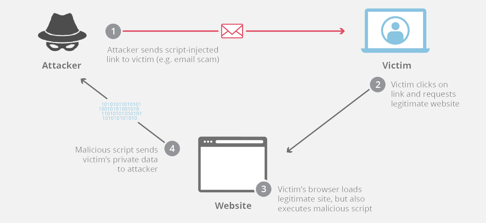

#  WEB UYGULAMA GÜVENLİĞİ GİRİŞ II
> Cenk Gökçe - Cyber Security & Development
> > [LinkedIn](https://www.linkedin.com/in/cenk-gokce-345b88190)  - [Medium](https://cnkgkce.medium.com/) - [Github](https://github.com/cnkgkce/)

# Cross Site Scripting (XSS)

### Zafiyetin Tanımı ve Oluşma Sebebi
Cross Site Scripting ya da kısaca bilinen adıyla XSS zafiyeti kullanıcının browser'ında script kodu çalıştırabilme temeline dayanmaktadır. XSS zafiyeti kullanıcıdan alınan ve HTTP Request içerisinde gönderilen datanın güvenilir olmayan bir biçimde geriye dönmesiyle oluşmaktadır. Cross site scripting uygulamanın ön yüzünü ilgilendiren ve genellikle sunucu ile herhangi bir ilişiği olmayan bir zafiyettir.

***Reflected XSS*** ve ***Stored XSS*** olmak üzere temelde 2 farklı türü bulunmaktadır fakat bunların yanında DOM-based XSS veya Blind XSS gibi türleri ile de zafiyetin çıkış noktasına göre reflected veya stored olarak kategorilendirilebilmektedir. Bu konu hakkında halen net bir görüş bulunmamakta farklı araştırmacılar farklı kategorilendirme işlemleri yapabilmektedirler.
#### Reflected XSS

#### Stored XSS

Reflected XSS o an gerçekleştirilebilen XSS türü iken Stored XSS veritabanına zararlı xss payload'unun kaydedilmesi ile gerçekleşir.

Bunların dışında çalıştırılan XSS kodunun kullanıcıya gösterilmeden çalıştırıldığı ***Blind XSS*** gibi türleri de bulunmaktadır.

### Zafiyetin Etkisi
XSS Zafiyeti oldukça kritik bir zafiyettir. Bu zafiyet sayesinde saldırganlar kurbanların oturum bilgilerini (session ve cookie)çalabilirler veya kendi yazmış oldukları veya hazırda kullanılan zararlı Javascript kodlarını kullanıcının browserında çalıştırabilirler. Bütün bunların yanında ilgili script ile bilgisayarlarına uzak bir sunucudan zararlı yazılım indirebilirler.

# XML External Entity (XXE)

### Zafiyetin Tanımı ve Oluşma Sebebi
XML (Extensible Markup Language) uygulama içinde veya uygulamalar arası veri transferinde oldukça sık ve yaygın kullanılan bir dildir. Son dönemlerde geliştirilen web  uygulamalarında veri transferi işlemleri için JSON kullanılsa da XML halen birçok web sitesinin veri transferinde kullanılmaktadır.

XXE zafiyetinin temelde oluşma sebebi XML içerisinde DTD içerisinde External bir Entity oluşturma ve XML Parser'ın bu Entity'i herhangi bir kontrole tabi tutmadan parse etmesidir.

### Zafiyetin Etkisi
Bu zafiyet sayesinde saldırganlar uygulama üzerinde barınan birtakım önemli dosyaları okuyabilirler veya kendi kontrolleri altında bulunan ve zararlı dosyalar içeren sunucularından kurban bilgisayarlarına zararlı yazılımları indirebilirler.

# File Upload Zafiyetleri

### Zafiyetin Tanımı ve Oluşma Sebebi
File uplaod zafiyetleri günümüz modern web uygulamalarında veya mimarilerinde pek sık karşılaşmadığımız veya zafiyetin istismarı sonrası sunucu  tarafında beklenildiği gibi sızma işlemini gerçekleştiremediğimiz  bir zafiyettir. Bunun sebebi derste detaylıca işlenmiştir :)

File Upload zafiyeti kullanıcı tarafından web uygulamasına yüklenebilen zararlı dosyalar üzerinde yeterli güvenlik kontrollerinin sağlanmaması sebebiyle ortaya çıkmaktadır. ***Bu kontroller client tarafta dosya uzantısı kontrolünden başlayarak sunucu tarafında dosyaların header bilgilerini kontrol etmeye kadar birçok noktayı kapsar.*** 

File uplaod zafiyetleri özellikle CTF'lerde 2 aşamadan oluşur. Birinci aşama olarak, web uygulaması tarafından gerek client tarafta gerek ise sunucu tarafında alınmış birtakım önlemlerin atlatılması ve zararlı dosyanın sunucu sistemine yüklenilmesi işlemidir.

İstismarın ikinci aşamasında ise ilgili dosyanın barındığı endpoint tespit edilip çalıştırılır ve ilgili sunucuya sızma işlemi gerçekleştirilmiş olur.

### Zafiyetin Etkisi
Web Penetrasyon testlerinde genellikle yukarıda bahsettiğimiz ilk aşamada zafiyeti tespit edip gerekli  bildirimler yapılmalıdır fakat uygulamanın statik dosyalarının yine uygulama ile aynı sunucu üzerinde barınması senaryosunda saldırganın ilgili  endpointi de bulup yüklediği  dosyayı başarıyla tetiklediği takdirde sunucuya sızma işlemi başarıyla gerçekleşmiş  olur.

# Business Logic Zafiyetleri

### Zafiyetin Tanımı ve Oluşma Sebebi
Business Logic zafiyeti, istismar edebilmek için ***genellikle*** herhangi bir saldırı payloaduna ihtiyaç duymadığımız bir zafiyettir. Zafiyetin temelde oluşum sebebi web uygulamalarının gittikçe kompleksleşen yapısı ile birlikte developerların geliştirdikleri sistem üzerindeki hakimiyetlerinin de gittikçe düşmesi sayılabilir.

Bu zafiyetleri tespit edip istismar edebilmek için uygulamanın hemen birçok fonksiyonunu dikkatli bir şekilde okuyabilmek ve ilgili mantık hatalarını yakalayabilmek gerekmektedir.

### Zafiyetin Etkisi
Business Logic zafiyetinin etkisi, zafiyetin tespit edildiği fonksiyonun uygulama içerisindeki konumuna bağlı olarak değişmektedir.

